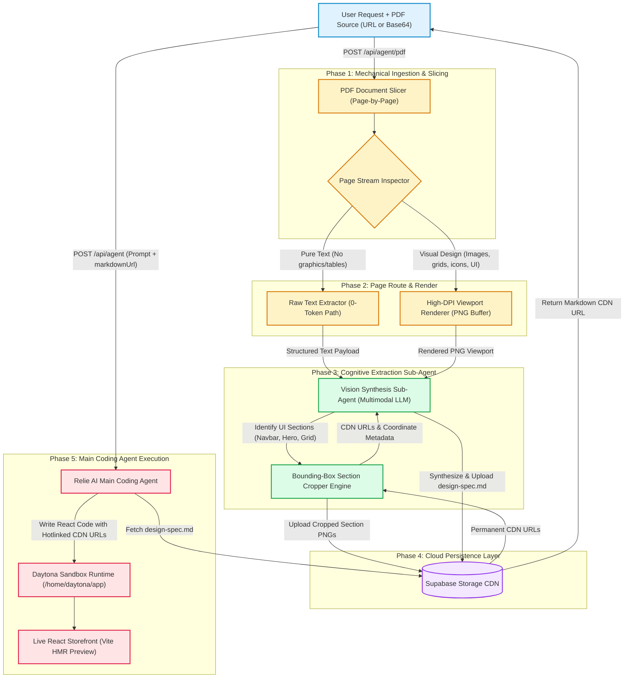
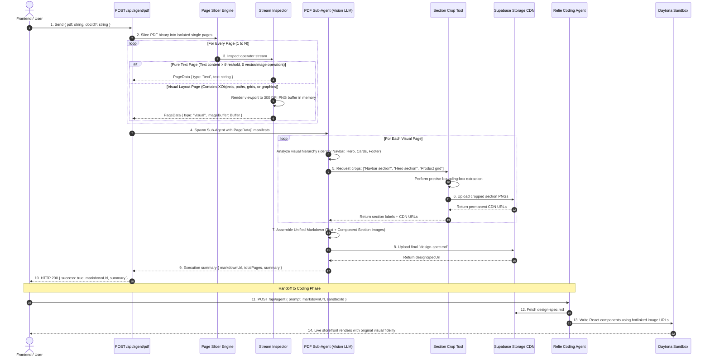
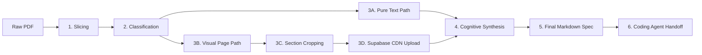
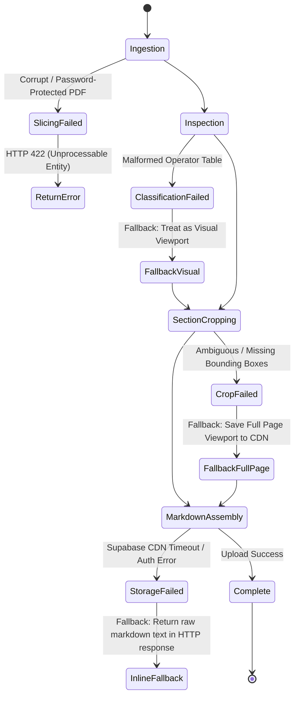

# PDF UI Extraction Sub-Agent: System Architecture & Design Specification
> **In-Depth Architectural Design Document for Multimodal PDF UI & Asset Extraction**  
> *Target System: Two-Tier Sub-Agent Pipeline | Next.js, LangChain DeepAgents, Supabase Storage, Daytona Sandbox*

---

## 1. System Vision & Problem Domain

When building e-commerce storefronts from client-provided PDFs (brand guidelines, Figma exports, design briefs, catalogs):
- **Raw PDFs are opaque**: Vision models cannot directly ingest multi-page binary PDFs efficiently.
- **Context Window Exhaustion**: Converting 10+ pages to base64 images inside a single coding agent conversation consumes 100,000+ tokens in one turn, stalling the agent and blowing API budgets.
- **Visual Blindness**: Standard text extractors (OCR or PDF text parsers) strip away crucial layout information—spacing, visual hierarchy, button styles, alignment, and color schemes.
- **Isolated Asset Deficit**: Cropping only tiny icons misses the overall section layout, while saving only full-page images makes it difficult to extract reusable component assets.

### The Architectural Solution
A **Two-Tier Decoupled Architecture**:
1. **Tier 1 (Extraction Sub-Agent):** An isolated, specialized pipeline that ingests the PDF, classifies pages, crops coherent UI sections, uploads high-resolution visual assets to cloud storage (Supabase), and synthesizes a structured Markdown design specification.
2. **Tier 2 (Main Coding Agent):** The primary engineering agent (Relie AI) that receives only the clean Markdown document and user prompt, referencing permanent cloud image URLs to construct React/Tailwind components inside an isolated development sandbox.

---

## 2. Global System Architecture



---

## 3. End-to-End Sequence & Data Flow



---

## 4. Architectural Decomposition

### 4.1 Component Responsibility Matrix

| Subsystem | Primary Responsibility | Input Contract | Output Contract | Storage Strategy |
|---|---|---|---|---|
| **Mechanical Slicer** | Splits raw multi-page PDF into independent memory buffers | PDF ArrayBuffer (URL / Base64) | Isolated Single-Page Buffers | In-Memory (Zero Disk Footprint) |
| **Stream Inspector** | Deterministic binary analysis to differentiate plain text from visual designs | Single-Page Buffer | Classification: `text` vs. `visual` | In-Memory |
| **Viewport Renderer** | Renders complex PDF pages into high-resolution PNG viewports | Visual Page Buffer | Raw PNG Buffer (Base64) | In-Memory (Not uploaded to cloud) |
| **Section Crop Tool** | Identifies and crops bounded UI sections (Navbar, Hero, Grid) | PNG Buffer + Section Labels | Bounded PNG Buffers | Supabase Storage (`/extracted/`) |
| **Extraction Sub-Agent** | Cognitive UI analysis, semantic structuring, and Markdown generation | Text pages + Section CDN URLs | Unified `design-spec.md` | Supabase Storage (`/designs/`) |
| **Main Coding Agent** | Translates Markdown spec into modular React components | User prompt + `markdownUrl` | React/Tailwind Source Code | Daytona Sandbox (`/home/daytona/app`) |

---

## 5. Detailed Step-by-Step Pipeline Mechanics



### Step 1: Ingestion & Slicing
- **Mechanism:** Ingests the PDF input as an in-memory binary `ArrayBuffer` from an HTTP/HTTPS URL or Base64 payload.
- **Page Isolation:** Slices the document into isolated single-page representations.
- **Why In-Memory:** Prevents writing temporary files to the server's local disk, avoiding concurrent user collisions and container disk fill-up.

### Step 2: Deterministic Classification (Text vs. Visual)
Rather than wasting vision tokens on every single page, an inspection algorithm examines the internal PDF operator table:
- **Pure Text Criteria:**
  - Presence of standard text operators (`showText`, `showSpans`).
  - Absence of raster image XObjects (`paintImageXObject`, `paintInlineImageXObject`).
  - Absence of vector path operations (used for borders, custom cards, or graphical backgrounds).
  - Text length exceeds minimal threshold (>50 characters).
- **Visual Design Criteria:**
  - Any page containing embedded images, complex vector strokes, color fills, layout grids, or diagrams.
  - Pages with low extracted text density but significant graphical content.

### Step 3: Viewport Rendering & Section Cropping
- **Viewport Rendering:** Visual pages are rendered into a high-DPI viewport PNG buffer in memory.
- **In-Memory Guardrail:** Full-page raw screenshots are **not** immediately dumped into Supabase Storage. They remain in memory to avoid polluting cloud buckets with disposable intermediate artifacts.
- **Section Extraction:** The Vision Sub-Agent inspects the viewport and directs the cropping engine to isolate distinct, functional UI components:
  1. *Navigation / Header Section* (Logo, search bar, navigation links, cart triggers).
  2. *Hero Section* (Primary banner, headline copy, promotional badge, call-to-action button).
  3. *Featured Product Section* (Card grid layout, pricing typography, hover overlays).
  4. *Testimonial / Social Proof Section* (Review stars, customer quotes, brand badges).
  5. *Footer Section* (Multi-column links, newsletter subscription, legal notices).
- **Persistence:** Only these cropped, functional UI section images are persisted to Supabase Storage, generating permanent public CDN URLs.

### Step 4: Cognitive Markdown Synthesis
The Sub-Agent synthesizes a unified, page-by-page Markdown document (`design-spec.md`) that maps 1-to-1 with the storefront component hierarchy:
- Text-only pages are formatted with semantic headings, structured lists, and markdown tables.
- Visual pages are structured into component sections, each containing:
  - Exact component name (e.g. `Navbar.tsx`, `HeroBanner.tsx`).
  - Extracted copy, typography styling, and color hex codes.
  - Permanent CDN image link of the visual section (``).

### Step 5: Handoff to Main Coding Agent
- The finalized `design-spec.md` is uploaded to Supabase Storage.
- The sub-agent endpoint returns a lightweight payload:
  ```json
  {
    "success": true,
    "markdownUrl": "https://xyz.supabase.co/.../design-spec.md",
    "totalPages": 5,
    "summary": "5-page minimalist jewelry storefront spec featuring sticky header, hero carousel, 4-column product grid, and newsletter footer."
  }
  ```
- The client injects the `markdownUrl` and `summary` into the Main Coding Agent's context.
- **The Main Agent never processes raw PDF data.** It fetches the Markdown document, opens the Daytona sandbox, and implements clean React code that hotlinks the CDN assets directly.

---

## 6. Data Contracts & Payload Schemas

### 6.1 Sub-Agent Route Request Contract (`POST /api/agent/pdf`)
```json
{
  "$schema": "http://json-schema.org/draft-07/schema#",
  "title": "PdfSubAgentRequest",
  "type": "object",
  "properties": {
    "pdf": {
      "type": "string",
      "description": "Publicly reachable HTTP/HTTPS URL or Base64 data string of the PDF."
    },
    "docId": {
      "type": "string",
      "description": "Optional unique document identifier for organizing storage assets."
    }
  },
  "required": ["pdf"]
}
```

### 6.2 Intermediate Page Manifest (Internal Memory Pipeline)
```json
{
  "docId": "doc_1726589000",
  "totalPages": 2,
  "pages": [
    {
      "pageNumber": 1,
      "classification": "text",
      "textContent": "Store Policies and Shipping Details..."
    },
    {
      "pageNumber": 2,
      "classification": "visual",
      "viewportBase64": "data:image/png;base64,iVBORw0KGgo...",
      "detectedSections": [
        {
          "name": "Header & Navbar",
          "box2d": [0, 0, 180, 1000],
          "storageUrl": "https://xyz.supabase.co/storage/v1/object/public/assets/extracted/navbar-1.png"
        },
        {
          "name": "Hero Banner",
          "box2d": [185, 0, 650, 1000],
          "storageUrl": "https://xyz.supabase.co/storage/v1/object/public/assets/extracted/hero-1.png"
        }
      ]
    }
  ]
}
```

### 6.3 Sub-Agent Route Response Contract
```json
{
  "success": true,
  "documentId": "doc_1726589000",
  "markdownUrl": "https://xyz.supabase.co/storage/v1/object/public/assets/designs/doc_1726589000/design-spec.md",
  "totalPages": 2,
  "summary": "E-commerce landing page design with sticky navigation bar and hero promotion.",
  "extractedSectionsCount": 2
}
```

---

## 7. Component Mapping: Markdown Specification to React Code

This table illustrates how the Sub-Agent's Markdown output directly drives the Main Coding Agent's component construction inside the Daytona sandbox:

```
┌────────────────────────────────────────────────────────┐
│  design-spec.md (Generated by Sub-Agent)               │
│                                                        │
│  ## 1. Header Navigation (`Header.tsx`)                │
│               │
│  - Background: #FFFFFF, Sticky top                     │
│  - Links: Home, Catalog, About                         │
│                                                        │
│  ## 2. Hero Section (`HeroSection.tsx`)                │
│                   │
│  - Headline: "Modern Craftsmanship"                    │
│  - CTA: "Shop Collection"                              │
└──────────────────────────┬─────────────────────────────┘
                           │
                           │ Coding Agent reads spec
                           ▼
┌────────────────────────────────────────────────────────┐
│  Daytona Sandbox: /home/daytona/app/src/App.tsx        │
│                                                        │
│  export default function App() {                       │
│    return (                                            │
│      <main className="min-h-screen bg-white">          │
│        <Header />                                      │
│        <HeroSection />                                 │
│      </main>                                           │
│    );                                                  │
│  }                                                     │
│                                                        │
│  // Live preview updates immediately via Vite HMR      │
└────────────────────────────────────────────────────────┘
```

---

## 8. Failure Modes, Resilience & Edge Cases



### 1. Corrupted or Password-Protected PDFs
- **Symptom:** `PDFDocument.load()` throws encryption or format exception.
- **Handling:** Immediately intercept at the mechanical layer; return structured error `{ success: false, error: "The provided document is password-protected or not a valid PDF." }` with HTTP 422. Avoid invoking any LLMs.

### 2. Ambiguous or Failed Section Cropping
- **Symptom:** The vision model fails to detect tight bounding boxes for individual components.
- **Handling:** The cropping engine automatically falls back to saving the full page image viewport into Supabase Storage, ensuring the main coding agent still receives a visual reference.

### 3. Large Multi-Page Documents (20+ Pages)
- **Symptom:** Sequential processing causes API route timeouts (HTTP 504).
- **Handling:** 
  - Pages are chunked into parallel batches of 5.
  - Text-only pages resolve instantaneously (under 10ms per page).
  - Visual pages are processed concurrently with `Promise.allSettled()`.

### 4. Supabase Storage Outage or Unset Credentials
- **Symptom:** Cloud storage upload returns network failure or permission error.
- **Handling:** The system degrades gracefully by returning the synthesized Markdown directly within the JSON response body, allowing the workflow to proceed without hard crashing.

---

## 9. Architectural Advantages

1. **Context Window Protection**: The main coding agent remains fast, responsive, and token-efficient because it only ever handles a concise Markdown file and user prompts.
2. **True Visual Fidelity**: By capturing and persisting coherent UI sections rather than disjointed icons, the coding agent accurately reproduces layout hierarchy, typography weight, and component spacing.
3. **Zero Local Sandbox Bloat**: Assets live in the Supabase Storage CDN and are hotlinked directly in the React components, eliminating complex file sync operations between the server and Daytona sandbox.
4. **Decoupled Testability**: The PDF extraction endpoint can be developed, tested, and benchmarked completely independently of the frontend chat interface and Daytona sandbox.
